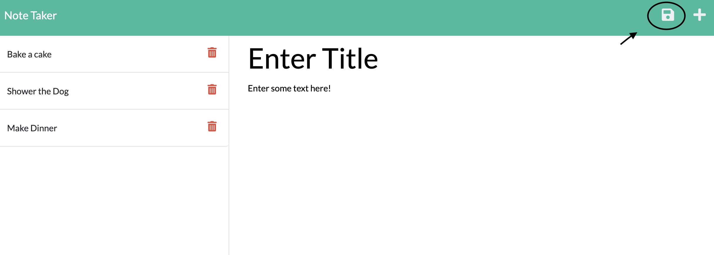
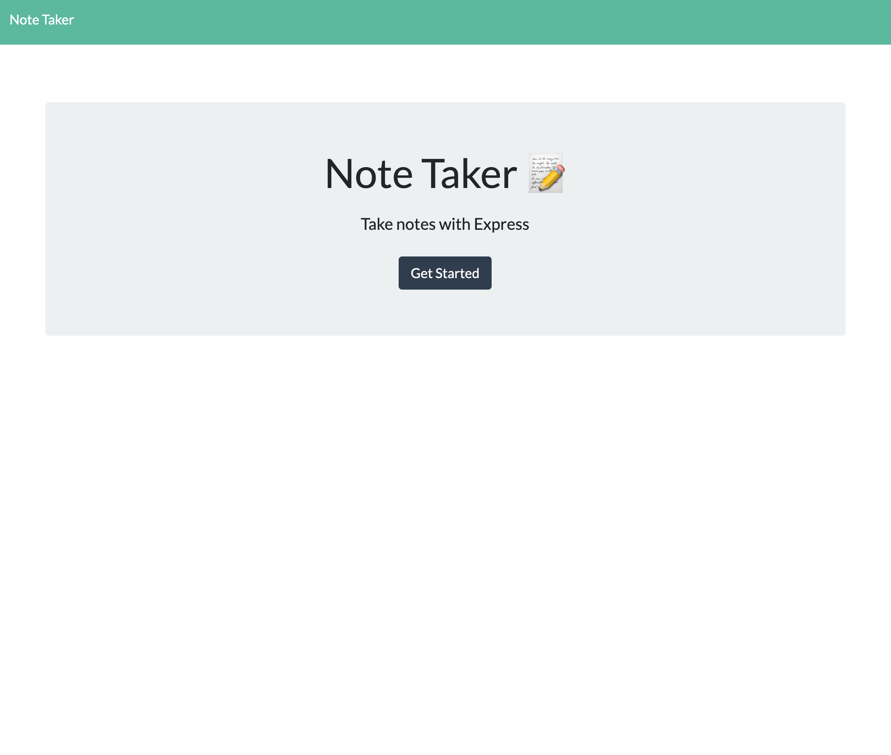
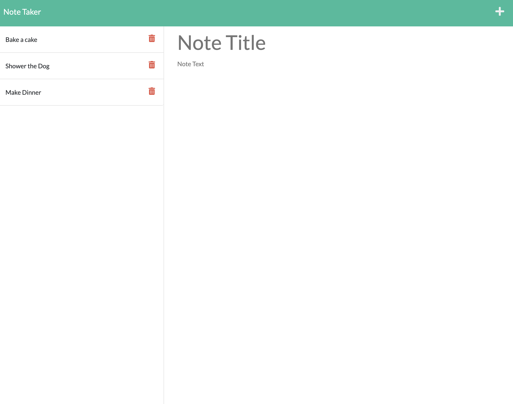

# Note-Taker

## Description

This application will help you organize your thoughts and keep track of tasks you need to complete or just help you store ideas. Using this application you can create notes by entering a title and also text. You will be able to save these notes and even delete them if you no longer need them.

## Table of Contents

- [Usage](#usage)
- [License](#license)
- [How to Contribute](#contribute)
- [Questions](#questions)

 
 
  
  ## Usage
After entering into the website, if you would to add a new note, do the following.

1. Enter text for the title of your note.

2. Enter a text below the title, whatever you want your note to contain.

3. To save this note and add it to the list of previously saved notes CLICK on the save icon on the top right. See below

### Website Pictures

Below you will see the first page of this application, then the second page

 
 

# Website URl

https://powerful-river-57581.herokuapp.com/

## License

The license used for this project: MIT

## Contribute

If you would like to contribute please contact me.

## Questions

To reach me please contact me in the email address below

- GitHub: `https://github.com/KarenHarley`
- Email: `karenharley88@gmail.com`
